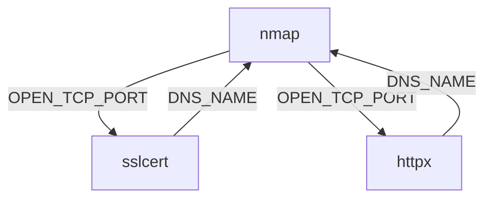

# What is BBOT?

BBOT is a system of individual modules that interchange data **recursively**. Every module (e.g. `nmap`) _consumes_ a type of data (e.g. a `DNS_NAME`) and _emits_ another kind, (an `OPEN_TCP_PORT`). These bits of data, called [events](scanning/events.md), become the output of the tool, but are also redistributed to all the other modules, prompting them to dig deeper, and feeding the recursive cycle of discovery.

## What It **_Isn't_**

It's important to understand that BBOT has a fundamentally different philosophy from most tools. Its discovery process does not have "phases", or "stages"; i.e. it does not work like this:

This is a traditional OSINT process, where you start with a target and you work in stages. Each stage gets you a little more data and requires more cleaning/deduplication, until finally you reach the end. The problem with this approach is that it **misses things**. 

Imagine if on the last step of this process, you discovered a new subdomain. Awesome! But shouldn't you go back and check that one the same way you did the others? Shouldn't you port-scan it and SSL-mine it, extract its web contents, and so on? Let's assume you do that, and maybe during that process you even discover another subdomain! What about this time? Should you start over again for that one? You see the dilemma.

## Recursion

Recursion is at the heart of BBOT's design. Each newly-discovered piece of data is fed it back into the machine, fueling the discovery process. This continues until there is no new data to discover.

## Module Example

In a simple example, we run a BBOT scan with **three modules**: `nmap`, `sslcert`, and `httpx`. Each of these modules "consume" a certain type of data:

- **`nmap`** consumes `DNS_NAME`s, port-scans them, and outputs `OPEN_TCP_PORT`s
- **`sslcert`** consumes `OPEN_TCP_PORT`s, grabs certs, and extracts `DNS_NAME`s
- **`httpx`** consumes `OPEN_TCP_PORT`s and visits any web services, ultimately producing new `DNS_NAME`s

This allows for some interesting chains of events. Given a single target such as `evilcorp.com`, `nmap` may start by discovering an `OPEN_TCP_PORT` `evilcorp.com:443`. `sslcert` and `httpx` will then visit that port and extract more hostnames, which are in turn scanned by `nmap` to produce more open ports which are visited by `sslcert` and `httpx`, which discover more hostnames, which are again passed to `nmap`, and so on...

This is a simple example with only a few modules, but you can being to see how if 30 or 40 modules were enabled, they could feed each other exponentially to produce an immense amount of data. This recursion is exactly how BBOT is able to outperform other tools.

For a full list of event types and which modules consume/produce them, see [List of Event Types](scanning/events.md#list-of-event-types).
